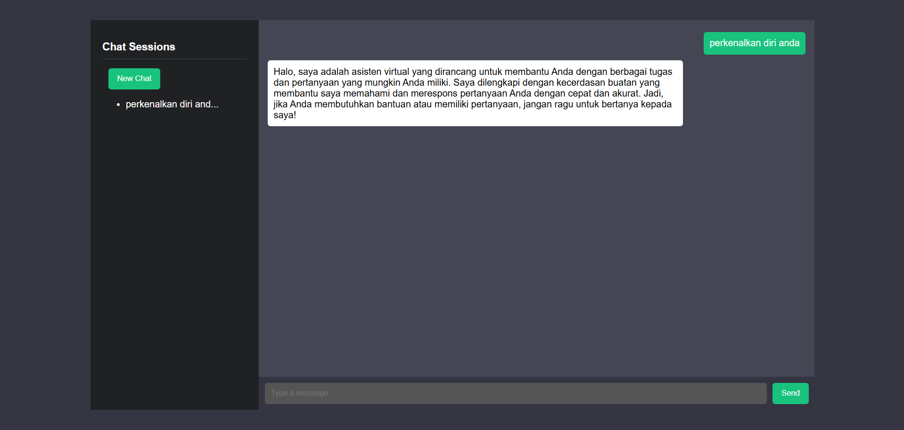

# 📌 Chatbot GPT Clone



## 📖 Deskripsi Proyek

Proyek ini adalah **Chatbot GPT Clone** berbasis **Flask** yang menggunakan **OpenRouter API** untuk menjalankan model GPT-3.5 Turbo. Chatbot ini menyimpan sesi percakapan secara terpisah, memungkinkan pengguna untuk membuka kembali sesi sebelumnya dan melanjutkan percakapan dari titik terakhir. Fitur utama dari proyek ini meliputi:

- ✅ **Menyimpan sesi chat per pengguna** dengan nama otomatis berdasarkan topik pertama.
- ✅ **Sidebar daftar sesi chat** yang dapat diakses kembali.
- ✅ **Efek "AI is typing..."** untuk pengalaman interaktif.
- ✅ **Tampilan sederhana dan modern mirip ChatGPT.**

## 📂 **Struktur Proyek**

```
CHATBOT/
│── .env  # File untuk menyimpan API key
│── app.py  # Backend utama berbasis Flask
│── requirements.txt  # Daftar dependensi yang diperlukan
│── static/
│   │── style.css  # Styling tampilan chatbot
│   └── script.js  # Script frontend untuk menangani chat dan history
│── templates/
│   └── index.html  # Halaman utama chatbot
│── data/
│   └── chat_sessions.json  # Database penyimpanan sesi chat
│── README.md  # Dokumentasi proyek ini
```

---

## 🚀 **Cara Instalasi dan Menjalankan Proyek**

### **1️⃣ Clone Repository**

Jika Anda menggunakan Git, jalankan perintah berikut:

```sh
 git clone https://github.com/andinoferdi/Chatbot.git
 cd Chatbot
```

Jika Anda tidak menggunakan Git, cukup unduh source code dan ekstrak di direktori pilihan Anda.

### **2️⃣ Buat Virtual Environment (Opsional tapi Disarankan)**

```sh
python -m venv venv
source venv/bin/activate  # Linux & Mac
venv\Scripts\activate  # Windows
```

### **3️⃣ Install Dependensi**

```sh
pip install -r requirements.txt
```

### **4️⃣ Konfigurasi API Key di `.env`**

Buat file `.env` di dalam folder proyek, lalu tambahkan:

```env
OPENROUTER_API_KEY=YOUR OPEN ROUTER API KEY
```

### **5️⃣ Jalankan Aplikasi**

```sh
python app.py
```

Aplikasi akan berjalan di **http://127.0.0.1:5000/**.

---

## 📜 **Fitur Utama**

✅ **Chat dengan AI berbasis OpenRouter API.**  
✅ **Menyimpan sesi chat dalam file JSON agar bisa diakses kembali.**  
✅ **Sidebar untuk memilih dan membuka sesi lama.**  
✅ **Nama sesi otomatis berdasarkan topik chat pertama.**  
✅ **Efek "AI is typing..." untuk pengalaman lebih realistis.**  
✅ **Tampilan mirip ChatGPT dengan CSS modern.**

---

## 🛠 **Teknologi yang Digunakan**

- **Flask** → Backend server untuk menangani API dan komunikasi dengan frontend.
- **JavaScript (Fetch API)** → Untuk menangani interaksi pengguna dengan chatbot.
- **HTML & CSS** → Untuk tampilan dan desain chatbot.
- **OpenRouter API** → Untuk menggunakan model GPT-3.5 Turbo.
- **JSON** → Untuk menyimpan sesi percakapan pengguna.

---

## 📜 **Lisensi**

Proyek ini dibuat untuk tujuan edukasi dan eksplorasi teknologi AI berbasis API. Bebas digunakan dan dimodifikasi sesuai kebutuhan Anda.

💡 **Dikembangkan oleh [Andino ferdiansah]** 🚀
